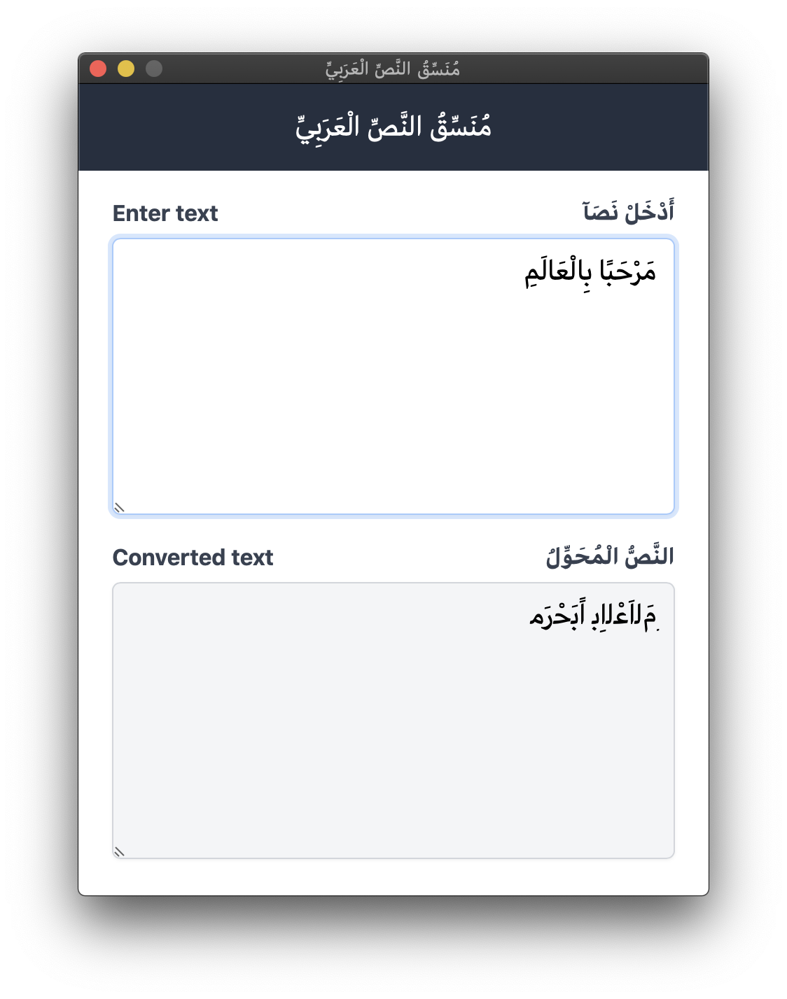

# Arabic Bidirectional Text

Write Arabic text on apps that don't support bidirectional text.

Built on top of tauri framework, React, Tailwindcss.

A web version is available at https://samirdjelal.github.io/bidirectional-web/

# Requirements

You must install Microsoft WebView2 if you have problems running the app in Windows Operating System.

[https://developer.microsoft.com/en-us/microsoft-edge/webview2/#download-section](https://developer.microsoft.com/en-us/microsoft-edge/webview2/#download-section)

# Screenshot

